# SCNT

## Introduction

**SCNT** (Single-Cell, Single-Nucleus, and Spatial Transcriptomics Analysis and Visualization Tools) is an R package designed to simplify the conversion of Seurat and H5ad objects and streamline analysis and visualization of single-cell and spatial transcriptomics data on the R platform. The package offers a range of features, including:

1. **Effortless Seurat and H5ad Conversion**: Simplifies the process of converting between Seurat and H5ad objects, offering support for users working across both Python and R platforms.
   
2. **Integrated QC and Doublet Removal**: Includes built-in functions for single-cell quality control and doublet detection/removal, significantly simplifying the traditional workflow to ensure quick and accurate data processing.

3. **ggplot2-Based Visualization**: Built on top of `ggplot2`, SCNT provides customizable functions for visualizing single-cell and spatial transcriptomics data. Users can generate beautiful plots with minimal effort, leveraging `ggplot2`'s extensive customization options.

4. **scFlow for Flow Cytometry Simulation**: A unique function that aids in simulating flow cytometry results within single-cell and spatial transcriptomics data, helping users integrate flow cytometry analysis into their workflows.

5. **Comprehensive Spatial Transcriptomics Support**: While spatial transcriptomics visualization is primarily handled in Python, SCNT provides an enriched R-based solution for these users, offering a greater range of options within the R ecosystem.

Most of SCNT's functions are based on **Seurat** and **ggplot2**, with Seurat's version requirement being at least 5.0.0.

---

## R Version Requirement
- R >= 4.1.0

---

## Dependencies
- `Seurat`
- `SeuratObject`
- `AUCell`
- `VISION`
- `ggplot2`
- `ggpubr`
- `DoubletFinder`
- `dplyr`
- `tidyr`
- `tibble`
- `Matrix`
- `reticulate`
- `ggrastr`
- `scales`
- `rlang`
- `stringr`
- `stats`
- `grDevices`
- `methods`
- `utils`

---

## Installation

You can install SCNT from GitHub using the following commands:

```r
# Install devtools (if not already installed)
if (!requireNamespace("devtools", quietly = TRUE))
    install.packages("devtools")

# Install SCNT from GitHub
devtools::install_github("746443qjb/SCNT")
```

---

## Getting Started with SCNT

### Data Preparation

The demonstration datasets include:
- **Spatial Transcriptomics**: Visium and Visium HD human kidney samples, downloaded from [10x Genomics](https://www.10xgenomics.com/).
- **Single-Cell RNA-seq**: Built-in demo dataset `pbmc3k` from the `SeuratData` package.

SCNT provides the following key functions:
- [`EasyQC`](#easyqc)
- [`EasyDoublet`](#easydoublet)
- [`GetPC`](#getpc)
- [`ReadST`](#readst)
- [`GetH5ad`](#geth5ad)
- [`GetSeurat`](#getseurat)
- [`scPlot`](#scplot)
- [`scDot`](#scdot)
- [`scMultipleDot`](#scmultipledot)
- [`stPlot`](#stplot)
- [`stFeature`](#stfeature)
- [`scFlow`](#scflow)

> 🔗 *Click on a function above to jump directly to its usage example below.*

---

### Load Required Packages and Demo Data

```r
library(SeuratData)
library(Seurat)
library(SCNT)

# Load the example dataset
data("pbmc3k")
pbmc <- UpdateSeuratObject(pbmc3k)
pbmc <- NormalizeData(pbmc)
pbmc <- FindVariableFeatures(pbmc, selection.method = "vst", nfeatures = 2000)
pbmc <- ScaleData(pbmc, verbose = TRUE)
pbmc <- RunPCA(pbmc, npcs = 50)
print(pbmc)
# An object of class Seurat 
# 13714 features across 2700 samples within 1 assay 
# Active assay: RNA (13714 features, 2000 variable features)
# 3 layers present: counts, data, scale.data
# 1 dimensional reduction calculated: pca
```

---

## `EasyQC`

Simple quality control function to filter cells based on multiple criteria:

```r
pbmc <- EasyQC(pbmc,
               species = "human",
               MT = 5,      # mitochondrial genes threshold
               RP = 5,      # ribosomal protein genes threshold
               HB = 1,      # hemoglobin genes threshold
               Feature_high = 5000,
               Feature_low = 200,
               Plot = TRUE)

print(pbmc)
# 13714 features across 2639 samples within 1 assay 
# Active assay: RNA (13714 features, 2000 variable features)
# 3 layers present: counts, data, scale.data
# 1 dimensional reduction calculated: pca
```

**Output:** A filtered Seurat object with optional QC plots.

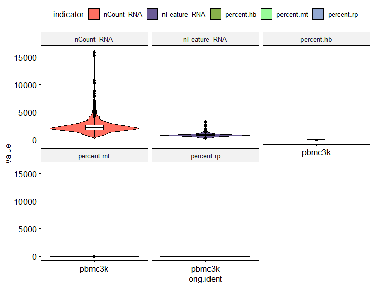

---

## `GetPC`

This function helps you select the optimal number of dimensions for dimensionality reduction - determining the ideal number of PCs to use.

```r
# Just run GetPC directly, don't assign the results
GetPC(pbmc, reduction = "pca", cum = 90, var = 5)
```

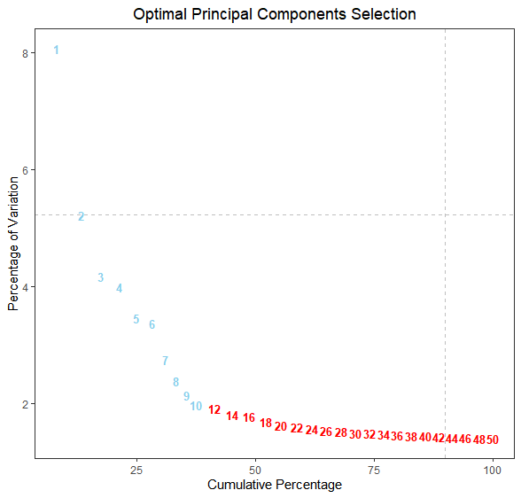

---

## `EasyDoublet`

Remove doublets with just a simple function call:

```r
pbmc <- EasyDoublet(pbmc, PC = 10, rate = 8, select = "high")

print(pbmc)
# An object of class Seurat 
# 13714 features across 2583 samples within 1 assay 
# Active assay: RNA (13714 features, 2000 variable features)
# 3 layers present: counts, data, scale.data
# 1 dimensional reduction calculated: pca
```

---

## `ReadST`

10X's built-in read function doesn't allow selecting image resolution (defaults to low resolution). This function adds this parameter, allowing you to freely choose high or low resolution images.

```r
# For Visium
ST <- ReadST(data.dir = "Visium/", image.type = "hires", assay = "Spatial")
print(ST)
# An object of class Seurat 
# 18085 features across 5936 samples within 1 assay 
# Active assay: Spatial (18085 features, 0 variable features)
# 1 layer present: counts
# 1 spatial field of view present: slice1

# For Visium HD
STHD <- ReadST(data.dir = "Visium_HD_Human_Kidney_FFPE_binned_outputs/",
               image.type = "hires", 
               assay = "Spatial",
               bin.size = 8)
print(STHD)
# An object of class Seurat 
# 18085 features across 666694 samples within 1 assay 
# Active assay: Spatial.008um (18085 features, 0 variable features)
# 1 layer present: counts
# 1 spatial field of view present: slice1.008um
```

---

## `GetH5ad`

Our conversion between Seurat and H5ad objects is performed in R, relying on the reticulate package. Ensure you have a suitable Python environment with anndata and other basic packages installed. Some important points to note:

1. The conversion primarily targets the raw matrices of single-cell or spatial transcriptomics objects, not normalized data. If you have multiple assays, select the appropriate one during conversion.
2. Metadata and dimensional information will be correctly converted.
3. For Seurat objects created by merging multiple objects, you must run JoinLayers function before conversion.
4. Since Python's anndata objects for spatial transcriptomics don't store image entities but rather image addresses, after running GetH5ad to convert to H5ad objects, you'll need to read the image addresses in Python. Note that image parameters and spatial coordinates will be correctly converted.

```r
library(reticulate)
py_config()
use_python("/path/to/your/python", required = TRUE)
# If using conda: use_condaenv("your_conda_env_name", required = TRUE)

# GetH5ad provides two modes: sc and st. The st mode will convert image, spatial coordinates, etc.
# First, the sc mode:
GetH5ad(
  pbmc,
  output_path = "pbmc.h5ad",
  mode = "sc",
  assay = "RNA")

# Let's check the result:
anndata <- import("anndata")
pbmcH5ad <- anndata$read_h5ad("pbmc.h5ad")
print(pbmcH5ad)
# AnnData object with n_obs × n_vars = 2583 × 13714
#    obs: 'orig.ident', 'nCount_RNA', 'nFeature_RNA', 'seurat_annotations', 'percent.mt', 'percent.rp', 'percent.hb', 'pANN_0.25_0.01_56', 'doublet_low', 'doublet_high', 'barcode'
#    obsm: 'X_pca'

# Now let's try st mode for HD data
GetH5ad(
  STHD,
  output_path = "STHDH5ad.h5ad",
  mode = "st",
  assay = "Spatial.008um",
  scale = "hires")

# Let's check:
STHDH5ad <- anndata$read_h5ad("STHDH5ad.h5ad")
print(STHDH5ad)
# AnnData object with n_obs × n_vars = 666694 × 18085
#    obs: 'orig.ident', 'nCount_Spatial.008um', 'nFeature_Spatial.008um', 'barcode'
#    uns: 'spatial'
#    obsm: 'spatial'
```

---

## `GetSeurat`

Since 10X Seurat objects have strict handling of image data for spatial transcriptomics, and anndata doesn't include image entities, this function is limited to converting expression matrices, metadata, and dimensionality reduction information.

```r
pbmc <- GetSeurat("E:/R包/test/pbmc.h5ad")

# Let's check:
print(pbmc)
# An object of class Seurat 
# 13714 features across 2583 samples within 1 assay 
# Active assay: RNA (13714 features, 0 variable features)
# 1 layer present: counts
# 1 dimensional reduction calculated: pca
```

---

## `scPlot`

SCNT provides ggplot2-based single-cell UMAP/t-SNE visualization. Users can freely adjust various parts of the image content according to personal preferences using ggplot2 parameters.

```r
pbmc <- RunUMAP(pbmc, dims = 1:10)
pbmc <- FindNeighbors(pbmc)
pbmc <- FindClusters(pbmc, resolution = 0.2)

P <- scPlot(
  pbmc,
  group_by = "seurat_clusters",
  reduction = "umap",
  point_size = 1.2,
  label_size = 5,
  colors = NULL,
  legend_cols = 1,
  raster_dpi = 600
)
```

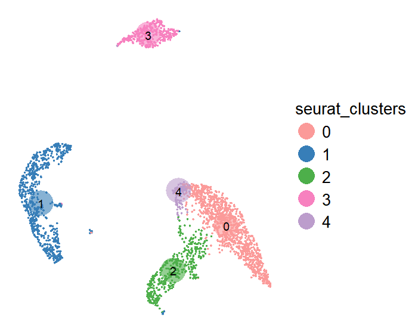

We can adjust ggplot2 theme parameters to try a cooler style:

```r
P1 <- P +
  theme(
    plot.background = element_rect(fill = "black", color = "black"),  
    panel.background = element_rect(fill = "black"),  
    legend.title = element_text(color = "white"),  
    legend.text = element_text(color = "white")
  )
```

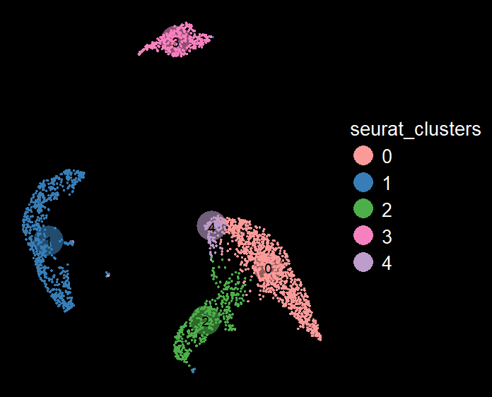

---

## `scDot`

We provide ggplot2-based bubble charts. Compared to traditional DotPlot functions, we have added a key parameter that allows plotting both standardized and non-standardized gene expression data to suit different needs.

First, let's see standardized expression:

```r
markers <- c("CD3D", "MS4A1", "NCAM1", "GNLY", "CD14", "LYZ", "CD1C")
scDot(
  pbmc,
  markers,
  celltype_var = "seurat_clusters",
  assay_layer = "data",
  standardize = TRUE)
```

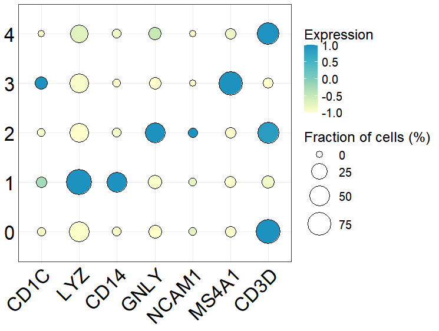

Now, non-standardized expression:

```r
scDot(
  pbmc,
  markers,
  celltype_var = "seurat_clusters",
  assay_layer = "data",
  standardize = FALSE)
```

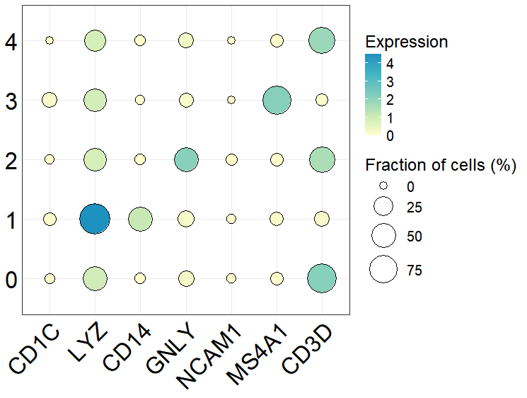

---

## `scMultipleDot`

We also provide an option to display multiple bubble charts of gene expression across different groupings together:

```r
# First randomly group cells
set.seed(123)  
cell_num <- ncol(pbmc) 
group_labels <- sample(c("A", "B"), size = cell_num, replace = TRUE)
pbmc$group <- group_labels
table(pbmc$group)
# A    B 
# 1377 1323 

# Now create the multiple dot plot
scMultipleDot(
  pbmc,
  markers = markers,
  group_var = "seurat_clusters",
  condition_var = "group",
  standardize = TRUE)
```

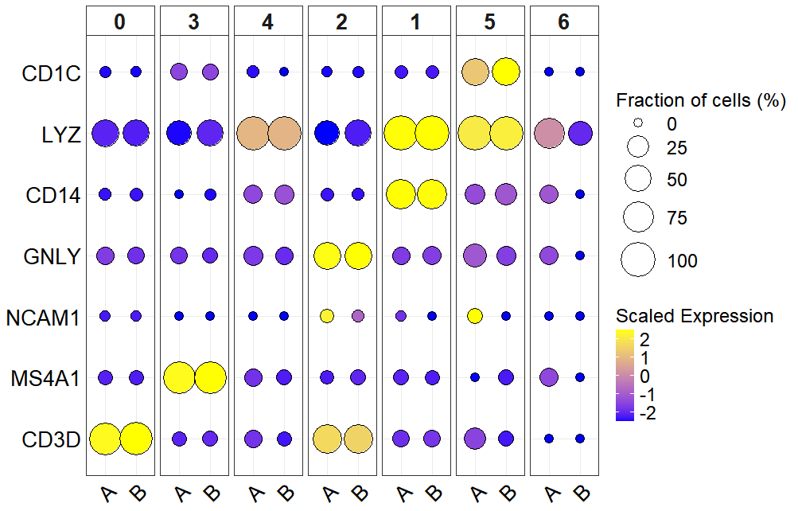

---

## `stPlot`

For spatial transcriptomics visualization, we've built extremely concise visualization functions based on ggplot2. They support freely changing parameters for personalized plotting and quickly visualizing partial regions of images (partial region visualization is a highlight that needs special formatting).

Our spatial transcriptomics visualization functions demo primarily uses 10X Visium HD, but Visium data works the same way.

First, let's do some basic processing of the HD data:

```r
STHD <- STHD %>% NormalizeData(verbose = FALSE) %>%
  FindVariableFeatures(verbose = FALSE) %>% 
  ScaleData(verbose = FALSE)
STHD <- SketchData(
  object = STHD,
  ncells = 10000,
  method = "LeverageScore",
  sketched.assay = "sketch"
)
DefaultAssay(STHD) <- "sketch"
STHD <- STHD %>% FindVariableFeatures() %>% 
  ScaleData() %>% 
  RunPCA(assay = "sketch", reduction.name = "pca.sketch") %>% 
  FindNeighbors(assay = "sketch", reduction = "pca.sketch", dims = 1:50) %>% 
  FindClusters(cluster.name = "seurat_cluster.sketched", resolution = 1) %>% 
  RunUMAP(reduction = "pca.sketch", reduction.name = "umap.sketch", return.model = TRUE, dims = 1:50)
options(future.globals.maxSize = 2e9) 
STHD <- ProjectData(
  object = STHD,
  assay = "Spatial.008um",
  full.reduction = "full.pca.sketch",
  sketched.assay = "sketch",
  sketched.reduction = "pca.sketch",
  umap.model = "umap.sketch",
  dims = 1:50,
  refdata = list(seurat_cluster.projected = "seurat_cluster.sketched")
)
```

Now, let's use stPlot for visualization:

```r
# You can set show_image to control whether to add background image
# Adding background image takes longer to run
P <- stPlot(
  STHD,
  group = "seurat_cluster.projected",
  color_list = colors,
  point_size = 0.1,
  title = "",
  x_label = "",
  y_label = "",
  image_scale = "slice1.008um",
  alpha = 0.5,
  x_range = c(0, 6000),
  y_range = c(0, 6000),
  max = 6000,
  show_image = FALSE)
```

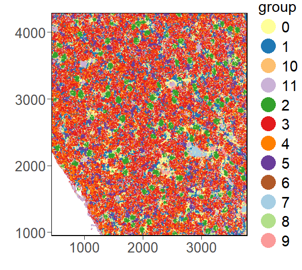  

Of course, we can change ggplot2 parameters to make the image cooler:

```r
P1 <- P +
  theme(
    plot.background = element_rect(fill = "black", color = "black"),  
    panel.background = element_rect(fill = "black"),  
    axis.text = element_text(color = "white"),  
    axis.title = element_text(color = "white"),  
    legend.title = element_text(color = "white"),  
    legend.text = element_text(color = "white"),
    panel.border = element_rect(color = "white", fill = NA, size = 1),
    legend.background = element_rect(fill = "black", color = "black")
  )
```

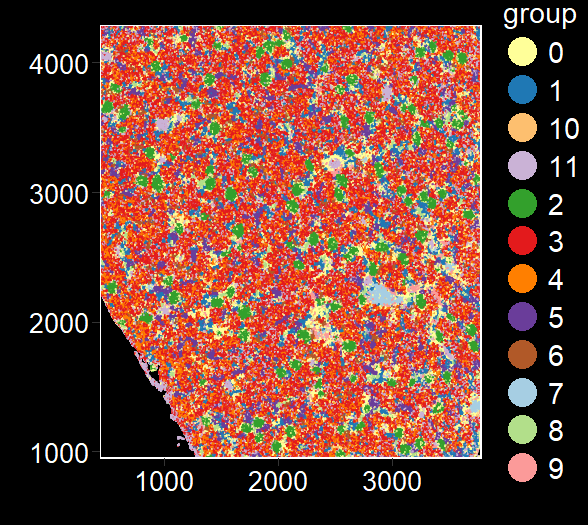  

Now let's visualize a local area (smaller regions plot faster):

```r
stPlot(
  STHD,
  group = "seurat_cluster.projected",
  color_list = colors,
  point_size = 1,
  title = "",
  x_label = "",
  y_label = "",
  image_scale = "slice1.008um",
  alpha = 0.5,
  max = 6000,
  x_range = c(2000, 2500),
  y_range = c(2000, 2500),
  show_image = TRUE)
```

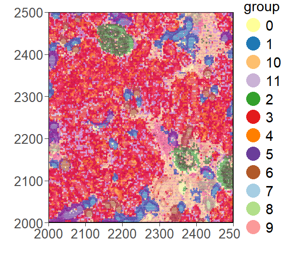  

---

## `stFeature`

This function is similar to stPlot in usage. You can freely select regions and choose whether to add background images:

```r
stFeature(
  STHD,
  feature = "LRP2",
  color = c("blue", "red"),
  point_size = 1,
  title = "",
  x_label = "",
  y_label = "",
  max = NULL,
  scale = "hires",
  image_scale = "slice1.008um",
  alpha = 0.5,
  x_range = NULL,
  y_range = NULL,
  show_image = FALSE)
```

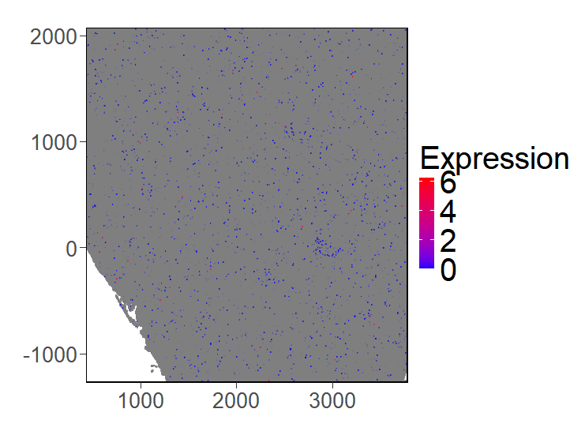  
  
Now let's visualize a local area:

```r
stFeature(
  STHD,
  feature = "LRP2",
  color = c("blue", "red"),
  point_size = 5,
  title = "",
  x_label = "",
  y_label = "",
  max = 6000,
  scale = "hires",
  image_scale = "slice1.008um",
  alpha = 0.5,
  x_range = c(2000, 2500),
  y_range = c(2000, 2500),
  show_image = TRUE)
```

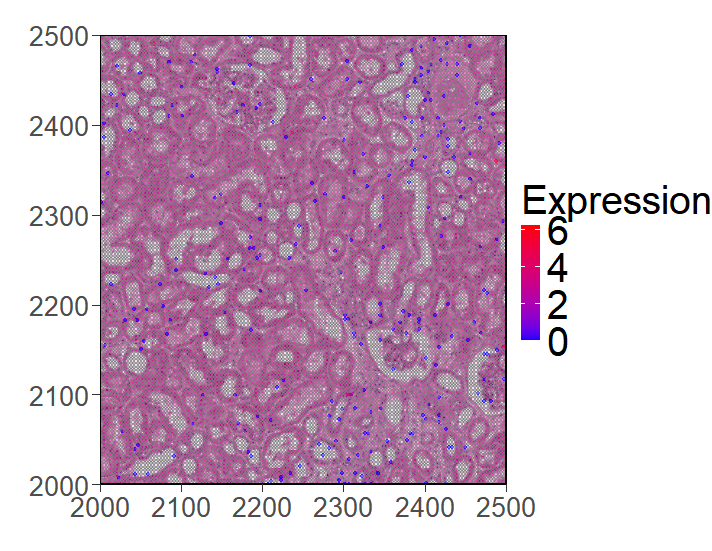  

---

## `scFlow`

This package provides a method for simulating flow cytometry in single-cell/spatial transcriptomics data to observe cell subtype tendencies. The function has two modes: with and without a reference gene. Without reference, it directly plots gene expression levels; with reference, it compares expression relative to the reference gene.

First, the mode without reference:

```r
scflow(
  pbmc,
  x_gene = "CD8A",
  y_gene = "CD4",
  ref = NULL,
  group = "orig.ident",
  x_cut = 10,
  y_cut = 10,
  assays = "RNA",
  color = c("white", "yellow", "orange", "red"),
  nrow = 1,
  ncol = 1,
  x_label_size = 20,
  y_label_size = 20,
  title_size = 20,
  legend_size = 20,
  axis_text_size = 10,
  common_legend = FALSE,
  cutline_color = "red",
  cutline_size = 0.8,
  point_size = 0.5,
  point_color = "black",
  point_alpha = 0.6,
  theme = "default",
  quad_text_size = 8,
  quad_text_color = "black")
```

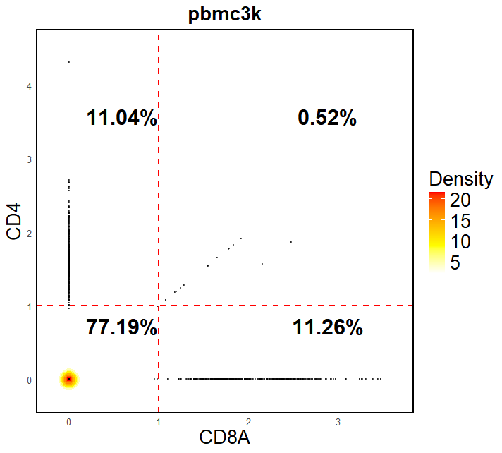  

Now with a reference gene:

```r
scflow(
  pbmc,
  x_gene = "CD8A",
  y_gene = "CD4",
  ref = "CD3D", # CD3D as reference gene
  group = "orig.ident",
  x_cut = 10,
  y_cut = 10,
  assays = "RNA",
  color = c("white", "yellow", "orange", "red"),
  nrow = 1,
  ncol = 1,
  x_label_size = 20,
  y_label_size = 20,
  title_size = 20,
  legend_size = 20,
  axis_text_size = 10,
  common_legend = FALSE,
  cutline_color = "red",
  cutline_size = 0.8,
  point_size = 0.5,
  point_color = "black",
  point_alpha = 0.6,
  theme = "default",
  quad_text_size = 8,
  quad_text_color = "black")
```

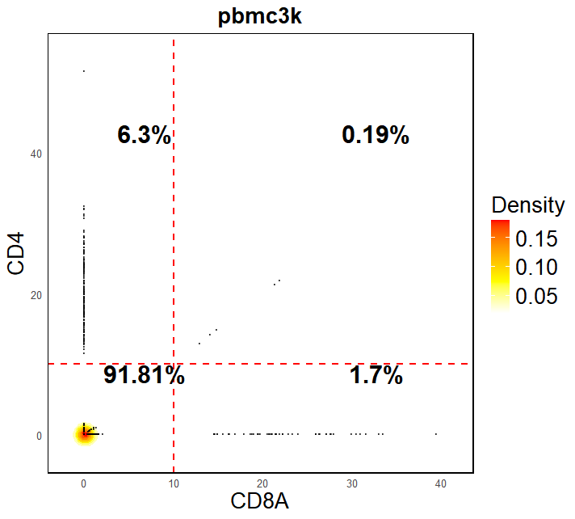  

SCNT's functionality will be continuously improved and refined in the future. If you encounter any issues or have feedback during use, please contact us at Jianboqing746443@163.com.
